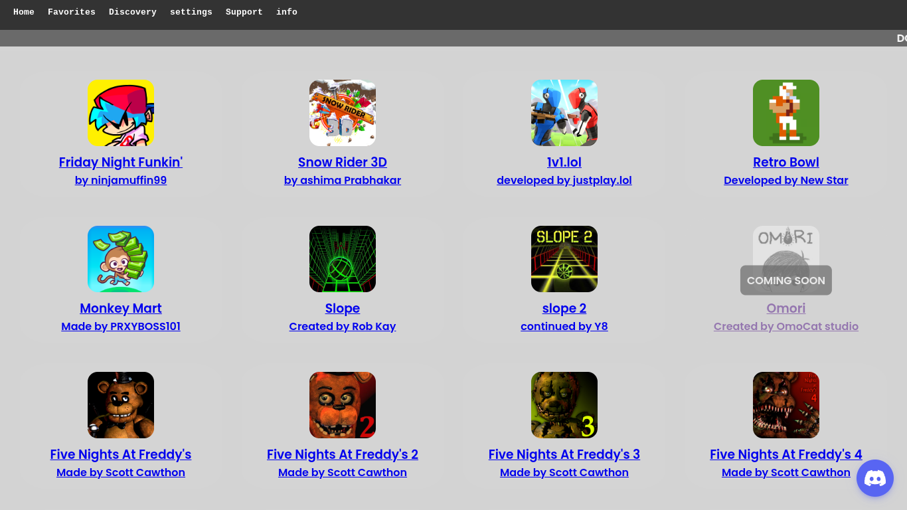

# *welcome to* **Jag.io** 
 - releasing at 60 stratagems!
**(should probably use json sooner or later lmao)**
= all 60 stratagems will be avaliable on release day!
- version 0.0.1
# Contributors:

  
  
  
   

## Preview

## Features
✔ 60+ popular Projects  
✔ Mobile and desktop friendly  
✔ No ads \
✔ Open-source, community-driven  

# credits
- @genizy for the ports <3 
- @WilardzySenpai for the loading screen
- @tw31122007 for source Library

  ## License
[MIT](LICENSE)
